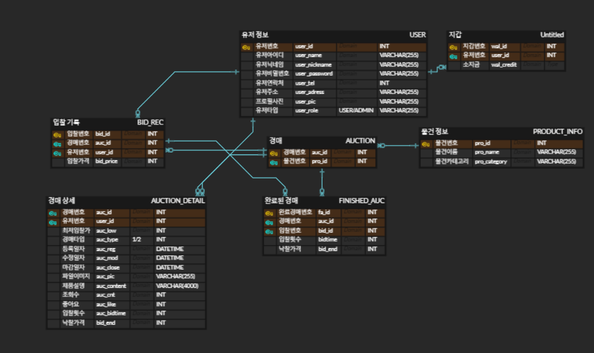

# CHUNGHYUN의 포트폴리오

저는 웹 개발에 관심이 많은 개발자 CHUNGHYUN입니다. 현재 프론트엔드와 백엔드를 아우르는 풀스택 개발에 집중하고 있으며, 다양한 프로젝트 경험을 통해 JavaScript와 Spring을 활용한 웹 애플리케이션 개발에 대한 깊은 이해를 쌓고 있습니다.

- 이메일: arisuww0424@gmail.com

## 프로젝트 소개

### 1. Poro (포트폴리오 공유 사이트)
- **제작 기간**: 2024/6/25 ~ 2024/7/29
- **사용 기술**: JavaScript, Spring
- **주요 기능**: 
  - 사용자가 자신의 포트폴리오를 등록하고, 다른 사용자의 포트폴리오에 댓글을 달 수 있는 기능
  - Instagram처럼 포트폴리오 클릭 시 해당 포트폴리오와 댓글창 모달 생성
- **ERD**: 
- **GitHub 링크**: 
  - [프론트엔드 저장소](https://github.com/NCamp-DevOps12-Group3/Portfolio-Mini-Project)
- **트러블슈팅 경험**:
  - 모달 창에서 비동기적으로 댓글을 불러오는 과정에서 발생한 성능 문제를 해결하기 위해, 댓글을 페이지네이션 방식으로 처리하여 성능을 최적화함.
- **회고 / 느낀 점**:
  - 처음 시도한 모달 기반의 댓글 시스템을 구현하면서 프론트엔드와 백엔드 간의 데이터 처리 흐름을 더 깊이 이해할 수 있었음.

### 2. CrownBid (실시간 경매 사이트)
- **제작 기간**: 2024/9/20 ~ 2024/10/4
- **사용 기술**: React, JavaScript, Spring Boot, MySQL
- **주요 기능**:
  - 실시간 경매(스트리밍 및 채팅)를 메인으로 지원하는 경매 사이트
  - 판매자가 물품을 등록하면, 예정된 시간에 경매 페이지가 자동으로 생성되고 실시간 스트리밍이 가능
  - 구매자는 경매 방에 입장하여 실시간 입찰 및 채팅 기능 이용 가능
- **ERD**: 
- **GitHub 링크**: 
  - [프론트엔드 저장소](https://github.com/Naver-Cloud-Team-Extreme/2nd_frontend)
  - [백엔드 저장소](https://github.com/Naver-Cloud-Team-Extreme/2nd_backend)
- **트러블슈팅 경험**:
  - 실시간 스트리밍과 채팅 기능 구현 시 WebSocket을 통해 통신할 때의 동시성 문제를 해결하기 위해 여러 번의 최적화 과정을 거쳤음. 특히 다수 사용자가 참여할 때 발생하는 서버 과부하 문제를 해결하기 위해 서버 부하 분산과 비동기 처리 방식 도입.
- **회고 / 느낀 점**:
  - 실시간 스트리밍 및 채팅 기능을 처음으로 구현하면서 WebSocket과 실시간 통신 기술에 대한 이해를 크게 높일 수 있었음. 특히 동시성 처리와 실시간 데이터 송수신의 어려움을 몸소 체험했고, 이를 해결하면서 서버와 클라이언트 간의 통신 흐름을 더 깊게 이해하게 됨.
